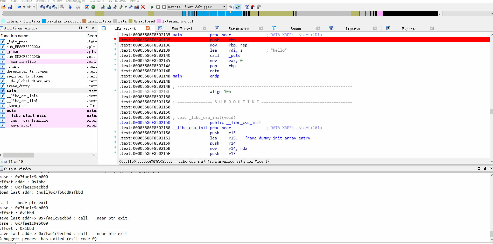

# 插件名称
easyF8

# 功能
在使用IDA进行动态调试的时候，为了加快我们分析的过程，我们经常可能要快速的单步执行（F8）。
而有时候，程序可能会因为各种异常情况退出（比如遇到反调试代码）,这个时候如果没有记下异常退出的位置，重新调试的时候又得重新跑一遍。
为了应对这种这种场景，我就使用idc语言开发了这个插件。功能很简单，大概介绍一下几个函数的作用：
1. saveLastAddr ： 保存光标所在的位置到addr.log，并且在下面的调试框打印出地址信息。
2. stepOverAndSave ： 单步执行（F8），并且保存当前光标的位置
3. loadLastAddr ： 从addr.log加载之前保存的光标，并且输出地址信息。

# 配置
1. 将easyF8.idc复制到ida目录下面的idc目录
2. 修改idc目录下面的ida.idc，加载easyF8.idc，并且配置快捷键。
```
#include <idc.idc>
#include <easyF8.idc>
...
static main(void)
{
	...
 	AddHotkey("q","stepOverAndSave");
  	AddHotkey("w","saveLastAddr");
  	AddHotkey("e","loadLastAddr");
  	...
}
```

# 使用截图
快捷键：	q w e
